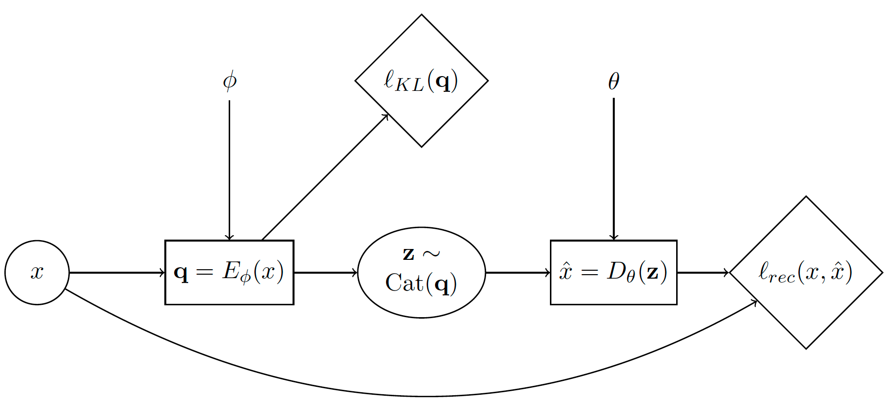

Discrete Gradient Estimation
----------------------------
.. role:: python(code)
   :language: python

Next, we are going to dive deeper into Storchastic's API and discuss how to use gradient estimation to train a variational
auto-encoder with a discrete latent space on MNIST.

Discrete Variational Auto-Encoder
^^^^^^^^^^^^^^^^^^^^^^^^^^^^^^^^^
A variational auto-encoder (VAE) is a popular family of generative deep learning models that use variational inference and
gradient estimation :cite:`b-kingma2013auto`. See :cite:`b-doersch2016tutorial` for a thorough mathematical introduction.
In this tutorial, we show how to train this model when using a discrete latent space using Storchastic. Let's first look
at the stochastic computation graph of VAEs:

The diamond nodes are deterministic nodes that represent cost functions (or "losses"). The corresponding generative story is:

#. Sample a datapoint :math:`x` from the dataset.

#. Compute :math:`\mathbf{q}=E_\phi(x)`. This is the logits of the variational distribution encoded from :math:`x`.

#. Sample :math:`\mathbf{z}\sim \operatorname{Cat}(\mathbf{q})` from categorical distribution with parameters :math:`\mathbf{q}`

#. Compute cost node :math:`\ell_{KL}(\mathbf{q})`. This is the KL-divergence of the prior with the variational posterior.

#. Compute :math:`\hat{x}=D_\theta(\mathbf{z})`. This decodes from :math:`\mathbf{z}` the reconstructed input :math:`\hat{x}`.

#. Compute cost node :math:`\ell_{rec}(x, \hat{x})`. This is the 'reconstruction' loss.

Because of the sample of :math:`\mathbf{z}\sim \operatorname{Cat}(\mathbf{q})`, we need to use gradient estimation.
Otherwise, we cannot train the parameters :math:`\phi`! Reparameterization is not an option, as we are dealing with
discrete random variables. Let's see how we can solve this using Storchastic.

First, we define the encoder :math:`E_\phi` and decoder :math:`D_\theta` networks. For both the encoder and decoder we use 2 fully
connected hidden layers with 512 and 256 hidden units. For the latent space, we will use 2 conditionally independent
categorical distributions of 10 choices. This means there are :math:`10^2=100` possible configurations to sum over.

.. code-block:: python
  :linenos:

  import torch
  import torch.nn as nn
  import storch
  from torch.distributions import OneHotCategorical

  class DiscreteVAE(nn.Module):
      def __init__(self):
          super().__init__()
          self.fc1 = nn.Linear(784, 512)
          self.fc2 = nn.Linear(512, 256)
          self.fc3 = nn.Linear(256, 2 * 10)
          self.fc4 = nn.Linear(2 * 10, 256)
          self.fc5 = nn.Linear(256, 512)
          self.fc6 = nn.Linear(512, 784)

      def encode(self, x):
          h1 = self.fc1(x).relu()
          h2 = self.fc2(h1).relu()
          return self.fc3(h2)

      def decode(self, z):
          h3 = self.fc4(z).relu()
          h4 = self.fc5(h3).relu()
          return self.fc6(h4).sigmoid()

In :meth:`DiscreteVAE.__init__`, we pass the :class:`storch.method.Method` that we will use to estimate gradients with
respect to :math:`\mathbf{q}`.

Time to translate our generative story!

.. code-block:: python
  :lineno-start: 28

  def generative_story(method: storch.method.Method, model: DiscreteVAE, data: torch.Tensor):
      x = storch.denote_independent(data.view(-1, 784), 0, "data")

:python:`data` is a tensor containing a minibatch of MNIST images of shape `(minibatch,28,28)`.
As we mentioned in our generative story, we **sample** a datapoint :math:`x` from the dataset. We thus have to tell
Storchastic that the first minibatch dimension is an **independent*** dimension! We give this dimension the plate name
"data".

.. code-block:: python
  :lineno-start: 30

      # Encode data. Shape: (data, 2 * 10)
      q_logits = model.encode(x)
      # Shape: (data, 2, 10)
      q_logits = q_logits.reshape(-1, 2, 10)
      # Define variational posterior
      q = OneHotCategorical(probs=q_logits.softmax(dim=-1))
      # Sample from variational posterior. Shape: (amt_samples, data, 2, 10)
      z = method(q)

Here, we define a one-hot categorical distribution based on the logits from the encoder. Using the passed
:class:`storch.method.Method`, we sample from this distribution to get :python:`z`. We have to reshape the logits and
sample to properly denote that we want 2 conditionally independent categorical latent variables with 10 choices, instead
of 1 categorical latent variable with 20 choices.

The KL-divergence loss :math:`\ell_{KL}(\mathbf{q})` can be computed using

.. code-block:: python
  :lineno-start: 37

      prior = OneHotCategorical(probs=torch.ones_like(q.probs) / 10.0)
      # Shape: (data)
      KL_div = torch.distributions.kl_divergence(q, prior).sum(-1)
      storch.add_cost(KL_div, "kl-div")

We define an uniform prior over the categorical random variables, and then use :func:`torch.distributions.kl_divergence`
to analytically compute the KL-divergence between this prior and the variational posterior we found. We want to minimize
this KL-divergence, so we use :func:`storch.add_cost` to register this node.

Next, we reconstruct :math:`\hat{x}` from :math:`z`, and compute the reconstruction loss:

.. code-block:: python
  :lineno-start: 41

      z_in = z.reshape(z.shape[:-2] + (2 * 10,))
      # Shape: (amt_samples, data, 784)
      reconstruction = model.decode(z_in)
      bce = torch.nn.BCELoss(reduction="none")(reconstruction, x).sum(-1)
      storch.add_cost(bce, "reconstruction")

      return z

Here we use our model to decode :math:`z`, then compute the binary cross entropy between the reconstruction and the
original datapoint. The computation of the binary cross entropy is a bit subtle. We first pass "none" to :python:`reduction`
to denote that we do not want to sum over the result, yet then we still sum over the last dimension afterwards. Why not:

.. code-block:: python

  >>> torch.nn.BCELoss(reduction="sum")(reconstruction, x)
  ValueError: Got an input tensor with too few dimensions. We expected 2 plate dimensions. Instead, we found only 0 dimensions. Violated at dimension 0

This error means that we have removed a **plate dimension**. Setting :python:`reduction="sum" makes the loss function return
only a single number. In Storchastic, it is not allowed to remove dimensions that are denoted as independent unless the
user explicitly asks Storchastic to do so. We can also, for example, not do the following:

.. code-block:: python

  >>> torch.mean(bce)
  ValueError: Got an input tensor with too few dimensions. We expected 2 plate dimensions. Instead, we found only 0 dimensions. Violated at dimension 0

Why would it not be allowed here, as we are just computing our loss function? We would average over our samples anyways?
Storchastic is no longer able to compute gradient estimates after one would take the mean. For example, if we use
the score function and we take multiple samples, we would need to multiply the log probability of the samples with the
corresponding computed loss. This happens during inference in :func:`storch.backward`. If we would have taken the mean,
we could no longer recover the individual loss outputs!

To make life easier, Storchastic is designed with "fail-quick" in mind. Therefore, if code is written that is likely to result
in such errors, it will crash!

Next, we load the MNIST dataset [#f1]_:

.. code-block:: python
  :lineno-start: 46

  from torchvision import datasets, transforms

  train_loader = torch.utils.data.DataLoader(
      datasets.MNIST(
          "./data", train=True, download=True, transform=transforms.ToTensor(),
      ),
      batch_size=64,
      shuffle=True,
  )

Finally, we put everything together in the training loop and add a training evaluation that also computes gradient variance:

.. code-block:: python
  :lineno-start: 53
  :emphasize-lines: 9

  def train(method: storch.method.Method, train_loader):
      model = DiscreteVAE()
      optimizer = torch.optim.Adam(model.parameters(), lr=1e-3)
      for epoch in range(5):
          print("Epoch:" + str(epoch + 1))
          for i, (data, _) in enumerate(train_loader):
              optimizer.zero_grad()

              generative_story(method, model, data)
              storch.backward()
              optimizer.step()
              if i % 300 == 0:
                  evaluate(method, model, data, optimizer)

  def evaluate(method: storch.method.Method, model: DiscreteVAE, data, optimizer):
      gradients = []
      for i in range(100):
          optimizer.zero_grad()

          z = generative_story(method, model, data)
          elbo = storch.backward()
          gradients.append(z.param_grads["probs"])
      gradients = storch.gather_samples(gradients, "gradients")

      print(
          "Training ELBO "
          + str(elbo.item())
          + ". Gradient variance "
          + str(storch.variance(gradients, "gradients")._tensor.item())
      )

We use an optimizer as normal, however, we call :func:`storch.backward` to compute the gradients. To get the gradient
for the gradient variance computation, we use :data:`storch.StochasticTensor.param_grads`. In this example, we
will do 5 training epochs.

Experimenting with the Discrete VAE
^^^^^^^^^^^^^^^^^^^^^^^^^^^^^^^^^^^
Let us naively try with the score function, no baseline and a single sample:

.. code-block:: python

  >>> train(storch.method.ScoreFunction("z", n_samples=1, baseline_factory="None"))
  Epoch:1
  Training ELBO 543.1165771484375. Gradient variance 12860.05078125
  Training ELBO 192.7163848876953. Gradient variance 1841.5672607421875
  Training ELBO 196.0297088623047. Gradient variance 146922.4375
  Training ELBO 203.4992218017578. Gradient variance 277160.9375
  Epoch:2
  Training ELBO 191.17823791503906. Gradient variance 28171.1796875
  Training ELBO 193.627685546875. Gradient variance 130113.6953125
  Training ELBO 200.20506286621094. Gradient variance 210252.90625
  Training ELBO 197.44796752929688. Gradient variance 523125.375
  Epoch:3
  Training ELBO 202.95068359375. Gradient variance 39035.52734375
  Training ELBO 195.01597595214844. Gradient variance 104070.5078125
  Training ELBO 198.34580993652344. Gradient variance 7388.16845703125
  Training ELBO 192.8509979248047. Gradient variance 457.5860595703125
  Epoch:4
  Training ELBO 184.8743896484375. Gradient variance 1029.0767822265625
  Training ELBO 201.11277770996094. Gradient variance 168409.390625
  Training ELBO 199.73178100585938. Gradient variance 13173.759765625
  Training ELBO 198.03358459472656. Gradient variance 4439.3017578125
  Epoch:5
  Training ELBO 194.9002685546875. Gradient variance 18869.560546875
  Training ELBO 188.87930297851562. Gradient variance 45681.5546875
  Training ELBO 209.60585021972656. Gradient variance 5402.30615234375
  Training ELBO 190.37799072265625. Gradient variance 34421.51953125

It clearly is training, but the training ELBO seems rather unstable. Let's again use the batch average baseline and
10 samples:

.. code-block:: python

  >>> train(storch.method.ScoreFunction("z", n_samples=10, baseline_factory="batch_average"), train_loader)
  Epoch:1
  Training ELBO 543.8447265625. Gradient variance 0.00031363777816295624
  Training ELBO 195.42037963867188. Gradient variance 4.808237075805664
  Training ELBO 176.24708557128906. Gradient variance 20.694387435913086
  Training ELBO 175.12139892578125. Gradient variance 114.5234375
  Epoch:2
  Training ELBO 161.55543518066406. Gradient variance 117.06814575195312
  Training ELBO 163.81021118164062. Gradient variance 764.1204223632812
  Training ELBO 167.0965576171875. Gradient variance 0.7521735429763794
  Training ELBO 163.2193145751953. Gradient variance 1854.9320068359375
  Epoch:3
  Training ELBO 165.54237365722656. Gradient variance 34.32332229614258
  Training ELBO 159.99176025390625. Gradient variance 121.91394805908203
  Training ELBO 149.61558532714844. Gradient variance 4.967251777648926
  Training ELBO 165.6819305419922. Gradient variance 2.564244270324707
  Epoch:4
  Training ELBO 156.40789794921875. Gradient variance 215.02999877929688
  Training ELBO 152.97520446777344. Gradient variance 258.04400634765625
  Training ELBO 157.0828094482422. Gradient variance 13.990401268005371
  Training ELBO 157.7599639892578. Gradient variance 1.4151099920272827
  Epoch:5
  Training ELBO 164.08978271484375. Gradient variance 391.89794921875
  Training ELBO 156.1527862548828. Gradient variance 2.9808785915374756
  Training ELBO 154.16932678222656. Gradient variance 10.244932174682617
  Training ELBO 151.02488708496094. Gradient variance 4701.791015625

Much better! Our variance reduction techniques help reduce the gradient variance by several factors, which results in
far lower training ELBO scores.

Another popular technique is the Gumbel-softmax-trick :cite:`b-jang2016categorical,b-maddison2016concrete`. This trick
uses a continuous that approximates the One Hot Categorical distribution. This distribution allows reparameterization.
Because the decoder of the Discrete VAE does not require its inputs to be discrete, we can apply this trick here!

The Gumbel-softmax trick is a biased gradient estimation tool. This means that it is not an estimate of the correct gradient.
Using :class:`storch.method.Expect`, we can estimate just how biased it is. Let's edit our evaluation function:

.. code-block:: python
  :emphasize-lines: 5

  def evaluate(method: storch.method.Method, model: DiscreteVAE, data, optimizer):
      # Compute expected gradient
      optimizer.zero_grad()

      z = generative_story(storch.method.Expect("z"), model, data)
      storch.backward()
      expected_gradient = z.param_grads["probs"]

      # Collect gradient samples
      gradients = []
      for i in range(100):
          optimizer.zero_grad()

          z = generative_story(method, model, data)
          elbo = storch.backward()
          gradients.append(z.param_grads["probs"])

      gradients = storch.gather_samples(gradients, "gradients")
      mean_gradient = storch.reduce_plates(gradients, "gradients")
      bias_gradient = (
          storch.reduce_plates((mean_gradient - expected_gradient) ** 2)
      ).sum()
      print(
          "Training ELBO "
          + str(elbo.item())
          + " Gradient variance "
          + str(storch.variance(gradients, "gradients")._tensor.item())
          + " Gradient bias "
          + str(bias_gradient._tensor.item())
      )

:class:`storch.method.Expect` is not a gradient estimation method, but computes the gradient analytically by summing over
all options. Because we have a small latent space of :math:`10^2=100` options, this is viable.

.. code-block:: python

  >>> train(storch.method.GumbelSoftmax("z", n_samples=1), train_loader)
  Epoch:1
  Training ELBO 543.6360473632812 Gradient variance 0.00038375251460820436 Gradient bias 2.135414251824841e-05
  Training ELBO 204.85665893554688 Gradient variance 5.555451931815725e-15 Gradient bias 5.555451931815725e-15
  Training ELBO 205.2622528076172 Gradient variance 5.326468432986786e-15 Gradient bias 5.326468432986786e-15
  Training ELBO 212.6741485595703 Gradient variance 0.001139726140536368 Gradient bias 0.5215573906898499
  Epoch:2
  Training ELBO 213.31932067871094 Gradient variance 6.1461252753858275e-15 Gradient bias 6.1461252753858275e-15
  Training ELBO 202.0615234375 Gradient variance 5.118301615869569e-15 Gradient bias 5.118301615869569e-15
  Training ELBO 211.42044067382812 Gradient variance 0.0004477511683944613 Gradient bias 1.2102100849151611
  Training ELBO 215.71697998046875 Gradient variance 2.4727771913424235e-12 Gradient bias 0.6834085583686829
  Epoch:3
  Training ELBO 221.59030151367188 Gradient variance 1.2252018451690674 Gradient bias 15.654888153076172
  Training ELBO 211.0780487060547 Gradient variance 2.080887545607979e-14 Gradient bias 2.080887545607979e-14
  Training ELBO 219.01422119140625 Gradient variance 2.0171364578658313e-14 Gradient bias 2.0171364578658313e-14
  Training ELBO 210.15830993652344 Gradient variance 2.049922731561793e-14 Gradient bias 2.049922731561793e-14
  Epoch:4
  Training ELBO 219.97352600097656 Gradient variance 2.148281552649678e-14 Gradient bias 2.148281552649678e-14
  Training ELBO 215.22779846191406 Gradient variance 2.0663158684097738e-14 Gradient bias 2.0663158684097738e-14
  Training ELBO 208.27081298828125 Gradient variance 2.0371725140133634e-14 Gradient bias 2.0371725140133634e-14
  Training ELBO 213.13644409179688 Gradient variance 2.049922731561793e-14 Gradient bias 2.049922731561793e-14
  Epoch:5
  Training ELBO 202.03463745117188 Gradient variance 1.931527854326376e-14 Gradient bias 1.931527854326376e-14
  Training ELBO 209.62664794921875 Gradient variance 2.0262437561147095e-14 Gradient bias 2.0262437561147095e-14
  Training ELBO 212.3344268798828 Gradient variance 1.951563910473908e-14 Gradient bias 1.951563910473908e-14
  Training ELBO 209.84085083007812 Gradient variance 1.993457482418748e-14 Gradient bias 1.993457482418748e-14

Oof, that is not great! The gumbel softmax does even worse than the score function without variance reduction. Theoretically,
using stochastic optimization with gradient estimation only for unbiased gradient estimation methods. We should note that
the gumbel-softmax performs much better for larger latent spaces, for example when using 20 categorical latent variables
of 10 options.

We could also just use :class:`storch.method.Expect` to train the model:

.. code-block:: python

  Epoch:1
  Training ELBO 543.6659545898438
  Training ELBO 175.1640625
  Training ELBO 163.3818359375
  Training ELBO 158.3362274169922
  Epoch:2
  Training ELBO 159.03167724609375
  Training ELBO 158.54054260253906
  Training ELBO 151.9814453125
  Training ELBO 162.34519958496094
  Epoch:3
  Training ELBO 154.2731475830078
  Training ELBO 159.92709350585938
  Training ELBO 157.92642211914062
  Training ELBO 147.97755432128906
  Epoch:4
  Training ELBO 151.23654174804688
  Training ELBO 155.57571411132812
  Training ELBO 142.53665161132812
  Training ELBO 141.1732635498047
  Epoch:5
  Training ELBO 152.55979919433594
  Training ELBO 154.68777465820312
  Training ELBO 151.78952026367188
  Training ELBO 156.02206420898438

Footnotes
"""""""""
.. [#f1] Note that it is best practice to use the binarized MNIST dataset as proposed by `<http://proceedings.mlr.press/v15/larochelle11a/larochelle11a.pdf>`_.

.. [#f2] It is very important to note that the Gumbel-softmax trick only applies to differentiable functions of continuous
  inputs. Using the straight-through variant (:python:`storch.method.GumbelSoftmax("z", straight_through=True)`), we can
  use it for *differentiable* functions of discrete inputs, however.

References
""""""""""
.. bibliography:: references.bib
   :labelprefix: B
   :keyprefix: b-
   :style: plain