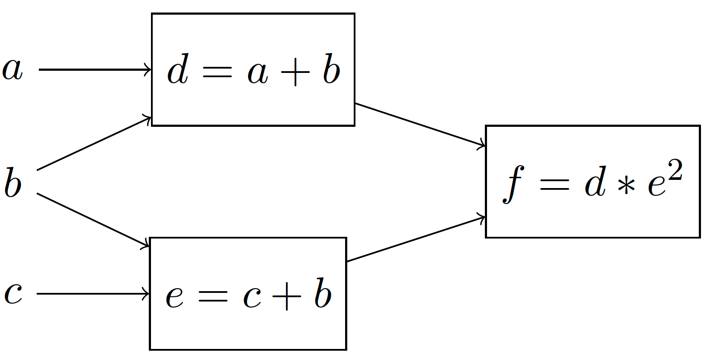
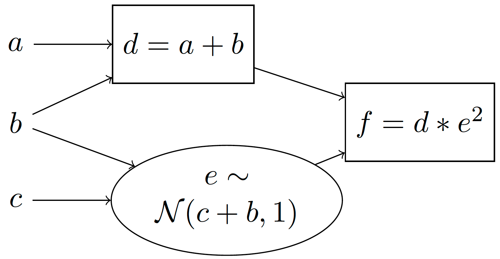
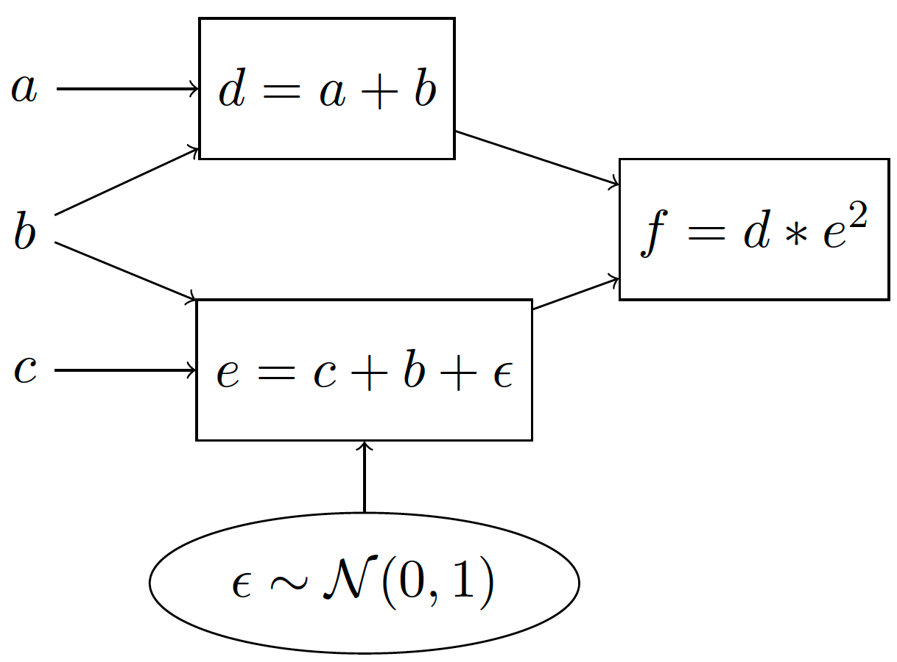

What is Storchastic?
--------------------

On this page we introduce the ideas behind Storchastic before diving into the code, and explain what kinds of problems
it could be applied to.
If you are already familiar with stochastic computation graphs :cite:`Schulman2015` and gradient estimation, you can
safely skip this page and start at :ref:`Sampling and Inference`.

Stochastic computation graphs
^^^^^^^^^^^^^^^^^^^^^^^^^^^^^
PyTorch relies on `computation graphs <http://colah.github.io/posts/2015-08-Backprop/>`_ for its automatic differentiation
algorithm. These graphs keeps track of all operations that happen while executing PyTorch code by recording the inputs
and outputs to PyTorch functions. Each node represents the output of some function. Consider the differentiable function

.. math:: f=(a + b) \cdot (b + c)

This function can be represented using a (deterministic) computation graph as

By assigning to :math:`a, b, c` a concrete value, we can deterministically compute the value of :math:`f`.
PyTorch then uses reverse-mode differentiation on such graphs to find the derivatives with respect to the parameters.

However, in many applications we are interested in computation graphs with *stochastic nodes*. Stochastic nodes are when
we take a sample from a distribution, and use the resulting sample to compute the output. For example, suppose that we
**sample** :math:`e` from a normal distribution with mean `c+b` and standard deviation 1. We can represent this using a
*stochastic* computation graph:

We use rectangles to denote deterministic computations and ellipses to denote stochastic computations.
We can also equivalently represent this using a *generative story*:

#. Compute :math:`d=a+b`

#. Sample :math:`e\sim \mathcal{N}(c+b, 1)` [#f1]_

#. Compute :math:`f=d\cdot e`.

A generative story is a nice and easy to understand way to show how outputs are generated step-by-step. The goal of Storchastic is to be able
to write code that looks just like a generative story. Because of this, we will present both stochastic computation
graphs and their associated generative stories in these tutorials.

A very common question in stochastic computation graphs is: What is the *expected* value of :math:`f`? Mathematically, this is computed as:

.. math:: \mathbb{E}_{e\sim \mathcal{N}(c+b, 1)}[(a+b)\cdot e]=\int p(e|b, c)\cdot (a+b)\cdot e\ de

This expression requires computing the integral over all values of :math:`e`, which is generally intractable. [#f2]_
A very common method to approximate expectations is to use *Monte Carlo* methods: Take some (say :math:`S`) samples of
:math:`e` from the normal distribution and average out the resulting values of :math:`f`:

..  math:: \mathbb{E}_{e\sim \mathcal{N}(c+b, 1)}[(a+b)\cdot e]\approx \frac{1}{S}\sum_{i=1}^S (a+b)\cdot e_i, \quad e_1, ..., e_S\sim \mathcal{N}(c+b, 1)
    :label: sample

Gradient estimation
^^^^^^^^^^^^^^^^^^^
We have shown a simple model with a stochastic node, and we have shown how to compute samples of the output. Next, assume
we are interested in the derivative with respect to input :math:`c` :math:`\frac{\partial}{\partial c}\mathbb{E}_{e\sim \mathcal{N}(c+b, 1)}[(a+b)\cdot e]`. For the same reason as before, we will use Monte Carlo estimation and sample some values
from the distribution to estimate the derivatives.

There is however a big issue here: Sampling is not a differentiable procedure! An easy way to see this is by looking at
equation :eq:`sample`: :math:`c` does not appear in the Monte Carlo estimation. This means we cannot use reverse-mode
differentiation to compute the derivatives with respect to the inputs :math:`b,c`. Luckily, we can use
*gradient estimation methods* :cite:`mohamed2019monte`.

The pathwise derivative
"""""""""""""""""""""""
A well known gradient estimation method is the *pathwise derivative* :cite:`glasserman1991gradient` which is commonly referred to in Machine Learning as *reparameterization* :cite:`kingma2013auto`. We explain this estimation method by transforming the previous stochastic computation graph to one that is equivalent:

Which has the following generative story:

#. Compute :math:`d=a+b`

#. Sample :math:`\epsilon \sim \mathcal{N}(0, 1)`

#. Compute :math:`f = c+b + \epsilon`

#. Compute :math:`f=d*e`.

The idea behind the pathwise derivative is to move the sampling procedure outside of the computation path, so that the
derivatives with respect to :math:`b, c` can now readily be computed using automatic differentiation! It works because
it shifts the mean of the 0-mean normal distribution by :math:`c+b`.

Unfortunately, this does not end our story, because the pathwise derivative has two heavy assumptions that limit its
applicability. The first is that a reparameterization must exist for the distribution to sample from. For the normal
distribution, this reparameterization is very simple, and a reparameterization has been derived for many other useful
continuous distributions. However, no (unbiased [#f3]_ ) reparameterization exists for discrete distributions!
Secondly, the pathwise derivative requires there to be a differentiable path from the sampling step to the output.
In many applications, such as in Reinforcement Learning, this is not the case.

The score function
""""""""""""""""""
The pathwise derivative is a great choice if it is applicable because it is unbiased and usually has low variance.
When it is not applicable, we can turn to the *score function*, which is known in Reinforcement Learning as *REINFORCE*.
Rewrite :math:`f` as a function of :math:`e` using :math:`f(e)=(a+b)\cdot e`. Then

.. math::

  \frac{\partial}{\partial c}\mathbb{E}_{e\sim \mathcal{N}(c+b, 1)}[f(e)] &= \frac{\partial}{\partial c}\int  p(e|b, c)f(e)  de \\
  &= \int  \frac{\partial}{\partial c} p(e|b, c) \frac{p(e|b, c)}{p(e|b, c)}f(e) de \\
  &= \int p(e|b, c)f(e) \frac{\partial}{\partial c}\log p(e|b, c) de\\
  &= \mathbb{E}_{e\sim \mathcal{N}(c+b, 1)}\left[f(e) \frac{\partial}{\partial c} \log p(e|b, c)\right]

By introducing the :math:`\log p(e|b, c)` term in the expectation, Monte Carlo samples now depend on :math:`c` and so we
can compute a derivative with respect to :math:`c`! Additionally, the score function can be used for any probability
distribution and also works for non-differentiable functions :math:`f`: It is universally applicable!

That sounds too good to be true, and unfortunately, it is. The score function is notorious for having very high *variance*.
The variance of an estimation method can be seen as the average difference between the samples. That means we will need
to look at many more samples to get a good idea of what gradient direction to follow.

Luckily, there is a significant amount of literature on variance-reduction methods, that aim to reduce the variance of
the score function. These greatly help to apply stochastic computation graphs in practice! Storchastic implements many
of these variance-reduction methods, to allow using stochastic computation graphs with non-differentiable functions and
discrete distributions.

Applications
^^^^^^^^^^^^

Reinforcement Learning
""""""""""""""""""""""
In Reinforcement Learning (RL), gradient estimation is a central research topic. The popular policy gradient algorithm is
the score function applied to the MDP model that is common in RL:

.. math::
  \nabla_\theta J(\theta) \propto \mathbb{E}_{s\sim p_\theta(s), a\sim p_\theta(a|s)}[Q_\pi(s, a)\nabla_\theta \log p_\theta(a|s)]

Decreasing the variance of this estimator is a very active research area, as lower-variance estimators generally require
fewer samples to train the agent. This is often done using so-called "actor-critic" algorithms, that reduce the variance
of the policy gradient estimator using a critic which predicts how good an action is relative to other possible actions.
Other recent algorithms make use of reparameterization to make use of the gradient of the critic :cite:`haarnoja2018soft,lillicrap2015continuous`.
There is active work on generalizing these ideas to stochastic computation graphs :cite:`weber2019credit`.

..
   TODO: add link to

Variational Inference
"""""""""""""""""""""

Footnotes
"""""""""
.. [#f1] :math:`\mathcal{N}(\mu, \sigma)` is a normal distribution with mean :math:`\mu` and standard deviation :math:`\sigma`.
.. [#f2] For a simple expression like this, a closed-form analytical form can pretty easily be found. However, usually our models are much more complex and non-linear.
.. [#f3] There is a very popular *biased* and low-variance reparameterization called the Gumbel-softmax-trick :cite:`jang2016categorical`, though!

References
""""""""""
.. bibliography:: references.bib
   :style: plain